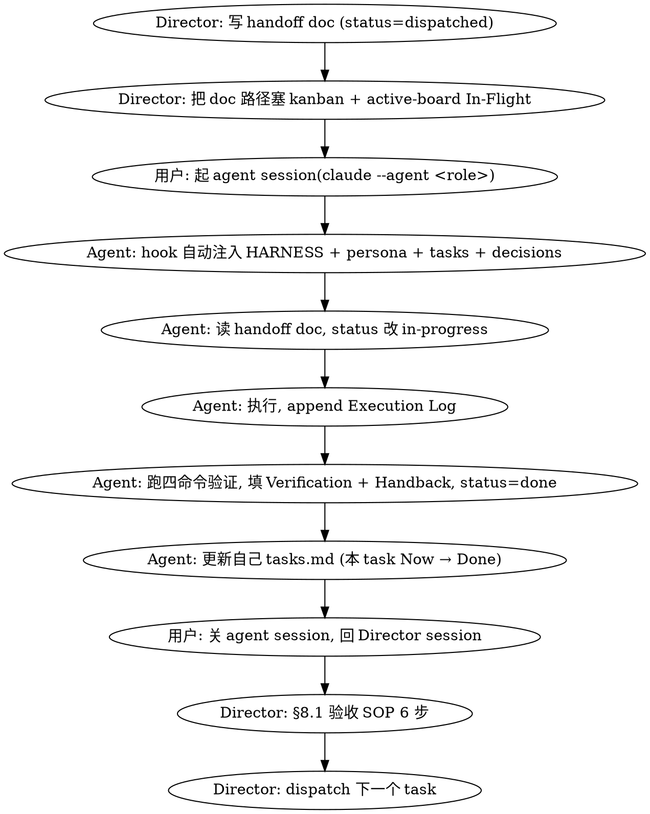

# Handoff Protocol — `<PROJECT>`

> Director 派工 → Agent(独立 CC session)执行 → Director 验收 的标准流程。
> 这是 game-team-kit 的核心金条款文件。§8 的每一条都是踩坑换来的,**bootstrap 新项目时整段保留**,只替占位符。
>
> 占位符约定:
> - `<PROJECT>` = 项目名
> - `<role>` / `<agent>` = 角色名(director / engine / ux / art / content / gameplay / qa / release / audio,或本项目定制的 backend / data / ml 等)
> - `<TASK-ID>` = 形如 `ENG-001` / `UX-012` 的任务号(前缀 = 角色缩写)
> - `<DEC-NNN>` = decisions.md 里的决策号
> - `<root>` = 项目仓库绝对路径
> - 形如 `npm test` / `npm run build` 的命令按本项目 toolchain 替换(见 §8.15 填写指引)

---

## §0 角色边界

- **Director(固定 session)**:写需求 / spec / 验收标准 / 调度。**不写代码**(任何代码改动都派给 agent)。这是硬边界,见 §8.12 inline 准入表。
- **Agent(独立 CC session)**:固定到一个角色(engine / ux / 等),读 HARNESS + 自己 persona + handoff doc,执行。**不接其他角色的活,不跨域**(跨域协调走 director)。
- **用户**:开 / 关 agent session;final approver;scope 决策的唯一拍板人。

> 为什么 director 不写码:多 agent 并行时,director 是唯一的全局视图持有者。一旦 director 下场写码,就丢失调度视角,且违反层隔离(见 HARNESS 层隔离表)。所有"我顺手改一下"的冲动都走 §8.12 准入表过滤。

---

## §1 Handoff 文件位置

```
team/<agent>/notes/<task-id>-<kebab-title>.md
```

例:
- `team/engine/notes/eng-001-<feature>-spec.md`
- `team/ux/notes/ux-003-<screen>-layout.md`
- `team/<role>/notes/<id>-<title>.md`

每个 handoff doc 是该 task 的单一权威源(spec + 执行日志 + 验收结果 + handback 都在里面)。

---

## §2 Handoff 文档模板

```markdown
# <TASK-ID> · <Title>

> Owner: <agent role>
> Dispatched: <YYYY-MM-DD> by Director
> Status: dispatched | in-progress | done | blocked
> Related: <DEC-NNN, 相关 task, 相关文件>

## Goal
<一段话,为什么做这个>

## Context
<必要的背景 / 约束 / 现状,让 agent 不用再问 director>

## Coordination
<见 §8.3 — 影响下游 / 受上游影响 / 跨 agent 集成风险>
- **影响下游 task**:<task-id> 及依赖关系
- **受上游 task 影响**:<task-id>(若 dispatch 时仍 in-progress / dispatched)
- **跨 agent 集成风险**:<配置冲突 / 命名空间 / 同时改一个文件 / 测试 glob 冲突 等>

## Interface / Design
<具体 spec — 接口、数据结构、文件结构、调用关系等>

## Acceptance Criteria
<硬性验收点,可机器检查最好(命令 / grep 模式 / test 文件)>
- [ ] <criterion 1>
- [ ] <criterion 2>

## Not in Scope
<明确不在本任务内的事,避免 scope creep>

## Execution Log
<agent 执行时填,append-only>
- <date>: <what was done>

## Verification
<agent 执行完填:跑了哪些验证命令(见 §8.15 四命令)、实测结果(pass / fail / count)>

## Handback
<agent 执行完填:产出物清单、blocker、给 director 的后续建议、建议 codify 的 DEC candidate(见 §8.11)>
```

---

## §3 工作流



---

## §4 Agent session 启动模式

### §4.1 当前态(推荐)— `claude --agent <role>`

角色已固化为 `.claude/agents/<role>.md` + SessionStart 注入 hook(`.claude/hooks/inject-role.sh`)。角色定位 / HARNESS / tasks / decisions 由 hook 自动注入,**派工只需传任务**:

```
claude --agent <role> "<task-id>: 一句话 · handoff 在 team/<role>/notes/<id>-*.md"
```

Director 不再输出整段启动咒。

### §4.2 Fallback — 整段启动咒(hook 未生效 / 临时手动起 session 时用)

```
你是 <AGENT_NAME> agent,固定该角色。

启动步骤:
1. 读 <root>/HARNESS.md(全 agent 约束,必读)
2. 读 team/<agent>/persona.md(你的角色定位)
3. 读 team/<agent>/tasks.md(你的任务看板)
4. 读 team/director/decisions.md 最近 5 条
5. 读今天的 handoff doc:<HANDOFF_PATH>

执行步骤:
1. handoff doc status 改 in-progress
2. 按 Goal / Interface 执行
3. 每个 milestone 在 Execution Log append 一条
4. 执行完跑 §8.15 四命令验证(按本项目 toolchain)
5. 填 Verification + Handback
6. status 改 done
7. 更新 team/<agent>/tasks.md(对应 task Now → Done)
8. 报告给用户:done / blocked / 需要 director 决策

不做的事:
- 不接其他 agent 工作(跨域协调走 director)
- 不私自 commit / push(HARNESS 边界)
- 不改 decisions.md(HARNESS 边界)
- 不改 scope(HARNESS 边界)
```

> **进化轨迹**(方法论要点):最早是用户每次手贴整段启动咒 → 沉淀为 `.claude/agents/<role>.md` 角色定义 + SessionStart hook 自动注入 → `claude --agent <role>` 一行起 session。kit 默认交付后者,启动咒留作 fallback。

---

## §5 Director 责任

- 写 handoff doc 时:把所有"agent 不该再问 director"的事写进 Context(context 完整)。
- Acceptance Criteria 必须可验证(命令、grep 模式、test 文件等)。
- 把 dispatch 记入 kanban + active-board(让全队可见)。
- 验收时:agent 的 Handback 写得不清楚 → 不算 done。
- **File ownership**:某些路径有 owner 角色(如 build infra / 配置文件归 release;UI 归 ux)。跨 owner 的改动派给 owner,不 inline(见 §8.12)。

---

## §6 例外纪律

- protocol 立之前的历史 exception,视为**一次性例外,不立先例**。落档时显式标注 "exception, 不立先例",后续所有 task 走标准 handoff 流。

---

## §7 异步报告机制

并行 session 增多时,Director 需要可见性。三层机制:

### §7.1 当前态(手工)— Active Board 文件

- `team/director/active-board.md` 是全队实时状态板。
- Director 在以下事件更新:
  1. 写新 handoff doc → 加 In-Flight 行
  2. 收到 agent 完成报告 → 移到 Recently Done
  3. 收到 blocked → 移到 Blocked
- **Agent 不直接编辑 board**(避免冲突),只改自己 handoff doc 的 `Status:` 字段,Director 同步过来。

### §7.2 半自动 — Director grep 扫状态

Director 无需等 agent 主动报告。任何时候跑:

```bash
# 完成但 director 还没 review 的 task
grep -l "Status: done" team/*/notes/*.md

# blocked
grep -l "Status: blocked" team/*/notes/*.md

# 整体 status 一览
grep -E "^> Status:" team/*/notes/*.md
```

agent 改 handoff doc status 即可被 Director 捕捉,**无需用户当中间人传话**。

### §7.3 未来异步(Loop-driven)

理想态:Director + 每个 agent 都跑 `/loop`,各自轮询。

**Director loop**(参考间隔 20-30 分钟):
```
/loop 1800s grep -l "Status: done" team/*/notes/*.md
对比 active-board.md::In-Flight,找新完成的
逐个 review handback → 更新 board → dispatch follow-up(如有)
```

**Agent loop**(参考间隔 5-10 分钟,看自己 notes/):
```
/loop 600s ls team/<agent>/notes/*.md | xargs grep -l "Status: dispatched"
如有新 dispatched 的 handoff doc(非自己执行中的),pick up:
  改 status → in-progress,执行 → done,填 handback,回 loop
```

**协议保证**:
- Status 字段是单一权威源(handoff doc 内)。
- Agent 只改自己角色 notes/ 下的 handoff doc。
- 同一 task 同一时间只 1 个 session 执行(由用户控制开多少 session)。
- Director loop 与 agent loop 不写同一文件(Director 写 board,agent 写 handoff doc)。
- 冲突点:同一 agent 多 session 都 pick 同一 dispatched task → 用户规避(只开 1 个该 agent session)。

### §7.4 Agent 完成后标准 ping(直到 §7.3 实现前)

1. 改 handoff doc:`Status: in-progress` → `Status: done`(或 `blocked`)。
2. 填 Verification + Handback 完整(否则 Director 视为未完成)。

之后向用户报告 done。用户回 Director session 贴 "<task-id> done" 或贴 Handback,Director 验收 + 更新 board。

---

## §8 Process 改进金条款 —— kit 最值钱的部件

> 以下每条都是真实项目里"踩坑 → retro → codify"换来的。bootstrap 新项目时**整段保留**,把游戏专属例子替换成本项目的等价场景即可。每条配一个"理由"说明它防的是哪类坑。

### §8.1 Director 验收 SOP

agent 报 "X done" → Director **不得跳过任何一步**:
1. `grep -l "Status: done"` 确认 status
2. Read 整个 handback 段(不是只看摘要)
3. 跑 spec AC 的可机器检查项(grep / wc / test 等)
4. 更新 `active-board.md`(In-Flight → Recently Done)
5. 更新 `kanban.md` 集成日记(verified + 关键 handback)
6. **再** dispatch follow-up

漏掉任一步 = process breach。

### §8.2 Pipeline 满则 Director idle(上限可调)

活跃 in-flight ≥ **N**(参考起步值 4,实测稳定后可放宽到 6)个 task → Director **不主动派新 task**,转入:
- Verify 已完成的 handback
- 更新 board / kanban / DEC
- 写 retro / phase transition 文档
- 架构 / 品牌决策 mood board(等用户回答)

除非用户明确要求继续 dispatch。

> 填写指引:N 起步设小(避免 director 一次性铺太多并行、失去可见性),团队磨合后按实测 peak session 数放宽。

### §8.3 Spec 必含 "Coordination" 字段

handoff doc 模板(§2)已含 Coordination 块,放在 Context 之后、Interface 之前:

```markdown
## Coordination
- **影响下游 task**:<task-id> 及依赖关系
- **受上游 task 影响**:<task-id>(若 dispatch 时仍 in-progress / dispatched)
- **跨 agent 集成风险**:<配置冲突 / 命名空间 / 同时改一个文件 / 测试 glob 冲突 等>
```

> 理由(通用例):QA agent 在 tests/ 下加 e2e 文件,可能与单测 runner 的默认 glob 冲突 → 应在 Coordination 块事前提示。事前提示比事后修复便宜。

### §8.4 Hook / API 扩展批 pattern

设计角色(如 gameplay / ux)在 handback 提的 hook / API 提案 → Director **不立即逐个 dispatch**,而是:
1. 攒满一个数量级(5+ 个)或一个语义域(同一子系统的一批 hook)
2. 单个底层(engine / backend)handoff doc 批量实现
3. 实现完后,**下游 design agent** 的实现 task 才可派

避免底层 agent 频繁 context switch(架构重构 ↔ hook 扩展 ↔ 性能优化)。

### §8.5 Agent 后置 housekeeping(硬性)

agent 完成 task 后**仅做 4 件事**:
1. handoff doc `Status: in-progress` → `Status: done`(或 `blocked`)
2. 填 Verification + Handback
3. 在 `team/<agent>/tasks.md` 中,**只把本 task** Now → Done
4. 向用户报告

**禁止**:
- 自己 promote 别的 task 从 Next 到 Now(Director 派活才入 Now)
- 自己写新 handoff doc(Director only)
- 自己改 decisions.md(HARNESS 边界)

### §8.6 Sprint 边界纪律

Sprint 切换前 Director **必须**:
1. 写 `team/director/sprint-N-retro.md`(模板:数字 / What worked / What didn't / Insights / 改进项 / 开放问题 / Phase 退出对账 / 下 Sprint 主线草拟)
2. 把改进项 codify 进 handoff-protocol / HARNESS / DEC
3. 把开放问题 ping 用户,等回答
4. 用户回答后才写 `sprint-N+1-roadmap.md` + dispatch Sprint N+1 第一波 task

**Sprint 之间不漂移**:retro 没写 / 改进没落 / 用户决策没拿到 → 新 Sprint 不算启动。

### §8.7 DD-first 品牌决策

ANY 品牌相关名(项目名 / 角色名 / 重大 brand / 域名 / tagline)在 DEC-accept 之前 **必跑 due diligence 三连**:
1. **市场搜索**:同名 / 同主题产品已存在?(对游戏 = Steam;对其他项目 = 对应分发渠道 / 应用商店 / 包管理器)
2. **Trademark search**:已注册的 TM 撞了?
3. **Domain availability**:`.com` / 对应 TLD 哪些可得?

DD 全过 → DEC-accept;DD 任一 fail → 弃用 + DEC 记录失败原因(供未来 brainstorm 避雷)。

**"先选后查"明令禁止**(典型坑:先 DEC 拍名,后做 DD 才发现撞名,命名 saga 拖多轮)。

### §8.8 UI / visual / brand task 默认 detection-gate

任何改以下路径的 task,spec AC **必含**两条 detection-gate:
- UI 层(CSS / DOM / animation,本项目对应路径)
- 打包 / 窗口 / 配置 / icon(本项目对应路径)
- player-facing / user-facing string(boot 文本 / 标题 / 状态文案 / 任何最终用户可见字符串)

**两条 gate**:
1. 跑 e2e 的 viewport + text-policy 检查(hit list attach handback,不强求 pass)
2. **director 必须**起 dev / 打包产物肉眼看过后才签 done(不能只信单测绿)

> 理由(通用模式 = "机器测过但 visual 实际坏"):累积出现 2 次"e2e 全绿但界面实际裂"(如布局裁切 / 旧品牌残留)即 codify。机器测无法替代肉眼 visual gate。

### §8.9 Task ID 防冲突 grep

Director 写新 spec 前 **必跑**(模式按本项目 task ID 格式调整):
```bash
grep -E "^(- \[[ x]\]\s+\*\*[A-Z]+-[0-9]+\*\*)" team/*/tasks.md | sort -u
```
列已有 ID,新 ID 未被占用才写。

> 理由:并行 session 多时,两个角色容易给不同 task 用同一 ID(如 logo 与 loading 屏重号)。task 数翻倍后不防会再撞。

### §8.10 Bug raise 必带 a/b/c 候选

任何 director 给用户 raise 的 bug / 问题,**必须**:
- 列 a/b/c 候选(至少 2 个,3 个最优)
- 明示 director 倾向(eg. "我倾向 b")
- 给每个候选简短 trade-off

**禁止**:笼统 "请 triage" / "怎么办" / 没具体候选的 raise。

> 理由:具体候选 + 倾向 → 用户一句话即可拍板(实测一次拍 5 项、一次拍 17 项)。笼统 raise → 来回拖。

### §8.11 类型 / 接口变更默认 codify DEC

任何以下变更,handback 必含 "建议加 DEC-NNN" suggestion;Director 默认 codify(除非明显小):
- 核心类型定义(本项目的 types / schema)变更
- 注册表 / hook 类型变更
- API signature 变更
- 核心 union / enum 增 / 改

**DEC 号码分配**:agent 在 spec / handback 只写"建议 DEC candidate"(**不锁具体号** · 跨 session 易撞)· **DEC 号由 Director 永远顺号分配**(codify 时查 decisions.md 最大号 + 1 · append-only)。

> 理由:6 个月后看 git history 会困惑"为啥从 X 改 Y"。codify DEC 留下"为什么"。曾有 agent 自己锁 DEC 号撞了 director 同回合已用号 → 由 director catch 顺号修正。

### §8.12 Director inline fix 准入条件

director **默认不写码**(§0)。极少数允许 inline 的情形严格按表:

| 改动类型 | 准入 | 必走 |
|---|---|---|
| **字面量替换**(string / attribute / 单 number) | ✅ 可 inline | append DEC(若 brand/规则)+ retro 检视 |
| **单 condition**(<, ===, &&, 单元 if) | ⚠️ 可 inline,**Sprint 内累积 ≤ 2** | 必 DEC + handback 单行说明 |
| **单 function 重构**(≥ 3 行 / 多 condition / loop logic) | ❌ **派 task** | 写 micro spec dispatch |
| **类型 / 接口变更** | ❌ 派 task | spec + handback raise DEC(§8.11) |
| **跨文件改动** | ❌ 派 task | spec + Coordination(§8.3) |
| **toolchain / build infra / 系统 destructive**(包管理器安装卸载 / 构建 target / 签名 / 公证 等) | ❌ **派 release agent** | 写 spec + 派 release · 不 inline |

**Sprint 内 inline 总次数硬上限 = 3**。超过 → retro 强制 flag + 下 sprint 退出标准扣分。

> 理由:每次 inline 都看似"用户 explicit 拍 + 单 condition / 字面量"自觉合理,但累积破坏 director 不写码边界。系统 destructive 操作(toolchain swap / cross-compile / sign)归 build infra owner(release),不 director inline。

### §8.13 Spec scope grep-verify

Director 写新 spec 前 **必跑** grep verify scope:
- **sweep / replace task**:`grep -rn '<old_keyword>' src/` 列所有 hit 文件,spec 的"涉及文件"列表直接来自 grep 输出。
- **detection task**:`grep -rl '<feature>' src/` 确认覆盖范围;若有 skip / debug 旁路 path,spec 必 explicit 列覆盖 limits + raise follow-up。
- **file lock 任务**(多 agent 改同文件):提前 grep 同 file 引用,Coordination 字段写 sequence。

> 理由:曾出现"字符串迁移漏了某个屏"、"detection 走了 skip 旁路漏检"——都是 spec 写时 director 没 grep。

### §8.14 Core 正确性规则 Sprint 0 锁 DEC

任何**最终用户可感知的 core 规则**禁止 implicit assume 初版默认值。每个新 Phase / Sprint 启动前 director 必跑 audit:
1. 列当前 implicit / explicit core 规则
2. 标 DEC 状态(已 DEC / 缺 DEC)
3. 补缺 = backfill DEC

> 通用例:游戏项目 = 死亡 / 胜利条件、阈值、AI 行为、回合顺序;非游戏项目 = 核心业务规则、权限边界、数据一致性约束、默认配置语义。
>
> 理由:初版 implicit 规则被多次 supersede,根因是启动时没 explicit 锁 DEC。第一次 audit 通常一次 backfill 一批。

### §8.15 Agent verification 必跑核心命令集

agent task verification **必含**以下命令(漏一条 = §8.5 housekeeping breach)。handback `Verification` 段必列实测结果。以本项目 toolchain 替换:

1. 单元测试(eg `npm test` / `pytest` / `cargo test`)
2. 独立类型检查(eg `npx tsc --noEmit` / `mypy`)
3. 端到端测试(eg `npm run test:e2e`)
4. **ship-level 构建**(eg `npm run build` = 类型检查 + 打包,catch 配置 / 静态 import / 构建链 gap)
5. **打包产物构建**(若 task 涉发布产物 / 原生壳,如 `npm run build:tauri`)

> 理由:曾有 handback claim "build pass" 但实际 fail(单测绿 ≠ 构建绿,构建链能 catch 单测 catch 不到的 gap)。第 4 条单独列出就是因为它被漏过。

### §8.16 Agent verification 必跑 full e2e suite

§8.15 第 3 条强化:**必跑完整 e2e suite**,不接受 isolated test file run。

handback `Verification` 段必含:
- e2e actual count(pass / fail / skip)
- 对比 spec 期望(eg "原 N pass + 新 M = N+M pass 期望")

> 理由:曾有 agent 跑单个 test file 全绿报 done,full suite catch 出 1 个 race fail。isolated test 不等于 full suite verification;isolated run 仅作 debug 工具。

### §8.17 asset-only / pure-asset task 可跳 e2e

asset-only task(**无 src 代码 change** · 仅资产目录 / 资产流水线输出)**可跳 e2e**,跑核心命令子集(单测 / 类型检查 / build)。验证以 asset spec(尺寸 / 格式 / 视觉自检 + **brand identity sanity check**)为主。

**边界**:用 CLI 生成发布产物(如 icon → 平台 icon 包,动到原生壳目录)= **release infra**,**不算 asset-only**,仍按 release infra 验。asset-only 限资产角色出资产目录 + 流水线输出。

> 理由:asset PNG / icon 替换时 e2e selector 不变,e2e 物理上 catch 不到资产视觉差异(UI 通过 `` / path 自动 pickup)。strict full e2e 对 asset-only 是空跑。

### §8.18 渲染层 / FontFaceSet Playwright probe

visual task(font / palette / 渲染层 / computed style)验证可用 Playwright probe 作 detection-gate 工具(比 e2e click assertion 精确):
- `document.fonts.check('14px "<font>"', '<目标语 sample>')` — 验 font 实际 paint(非 fallback)
- `getComputedStyle(el).fontFamily / color / ...` — 验 computed style
- 接入多语言 / CJK 字体必跑此 probe 验实渲(防"声称支持但实际回退 Latin"类误识)

不强制 · 作 director / qa toolbox。

> 理由:曾遇到字体名暗示支持某语言、实际 paint 是 fallback 字形;FontFaceSet probe 能 catch 这类 e2e 看不出的渲染回退。

---

## §9 Director session 启动咒(下一个 CC session 担任 director 时用)

> 复制以下整段作为新 CC session 首条 prompt(Director 持续性 — 跨 session 保持角色)。占位符按本项目填。

```
你是 <PROJECT> 项目的 Director,固定 director 角色,本 session 不写代码。

启动 checklist(全做完再动手):
1. 读 <root>/HARNESS.md(全 agent 约束 + 锁 scope 表)
2. 读 team/director/persona.md(工作原则)
3. 读 team/director/handoff-protocol.md 全文(派工与异步流程,**特别 §8 process 改进 严格执行**)
4. 读 team/director/sprint-<N-1>-retro.md(上 Sprint 复盘)
5. 读 team/director/sprint-<N>-roadmap.md(本 Sprint 主线 + 已 dispatch 状态)
6. 读 team/director/active-board.md(实时状态板,真实 in-flight)
7. 读 team/director/decisions.md 全文(所有 DEC — brand / scope / 架构 / process)
8. 跑 grep:`grep -E "^> Status:" team/*/notes/*.md` 同步真实状态

第一动作判断:
- 若 active-board 上有 `Status: done` 但未 review 的 → 按 §8.1 验收 SOP 6 步走
- 若 in-flight ≥ 上限(§8.2)→ idle,转 verify / 文档维护
- 若用户有 ping → 按需求响应

严格执行 §8 process 改进:
- §8.1 验收 SOP(grep / read handback / 跑 AC / 更新 board / 更新 kanban / 才 dispatch)
- §8.2 Pipeline 满则 idle
- §8.3 Spec 必含 Coordination 字段
- §8.4 Hook 批 pattern(攒批量,不分散派)
- §8.5 Agent housekeeping 硬性(禁止自 promote 别 task)
- §8.6 Sprint 边界纪律(Sprint 末写 retro + codify + ping 用户)
- §8.7 DD-first 品牌决策(ANY brand 名 DEC 前 DD)
- §8.8–8.18 各 detection / verification / inline 准入条款

不做的事:
- 不写代码(交 agent;例外严格按 §8.12 inline 准入表)
- 不替用户拿 scope 决策(raise candidates + verify + 用户拍板,§8.10)
- 不破 §8 流程(任何缩短 = process breach,记 kanban 集成日记)
- 不接其他角色工作(用户开新 agent session 担当)

外部工具(team/director/external-resources.md,按本项目填):
- <文案 / 命名 brainstorm 助手>
- <资产生产流水线>
- <动画 / 音频工程>
- WebSearch(DD 品牌)

期待第一回合:pong 用户 "Director on-line + 当前 pipeline 状态简报"。
```
